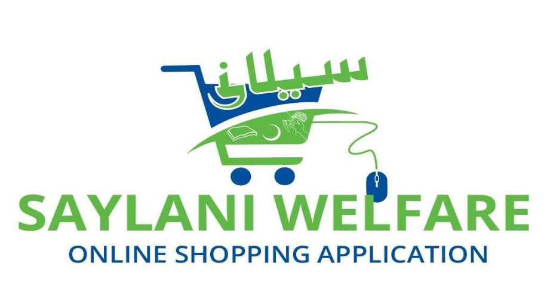

# SMIT Batch 1 Females Final HACKATHON 2023

## Online Shopping Application

## [Figma Link](https://www.figma.com/file/x2mXfy6Wvj5wLzIzyRxZFy/User-Side?node-id=1%3A2&t=huEhH9BN2kWeKMVJ-1)

**Note:** This project has been assigned to you as your Final Hackathon **Saylani Welfare Online Shopping Application**. You have to complete the given task within the time limit of 12 hours.

### What Admin can do?

- Sign in (As an admin)
- Admins would have their admin panels.
- Admin can approve the request of user for the advertisement of its product.
- Admin would have the access of all the user lists and their products so that he/she can assess their performance and can also block or suspend any users account in case of any illegal action.

### What User can Do?

- User would create its account by selecting categories:
  - Sale
  - Purchase
- Then user would upload his add by selecting his/her product details (price,category etc)
- Product advertisement would be live with the approval of admin. Advertisement would also be showing product details and its location on google map so that everyone can find its desired product easily.
