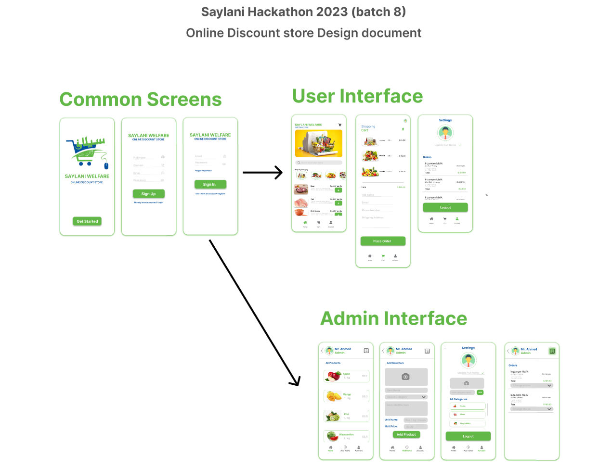

# SMIT Batch 8 Final HACKATHON 2023

## Store app

[Figma link](https://www.figma.com/file/e8juVRuVFr41nDUtVX2xlX/design-doc-saylani-online-discount-store?node-id=0%3A1&t=JkIspiDnGy4Z3eTL-0)

|                           |                                              |
| ------------------------- | -------------------------------------------- |
| Front end technology:     | React Native / Expo / React PWA (choose one) |
| Server technology:        | Nodejs / Express / None (choose one)         |
| Database technology:      | Firebase / MongoDB (choose one)              |
| Authentication Technique: | Firebase Auth / JWT (chose one)              |

### Features for User

- Login
- Signup
- Forget password feature is a plus point (optional)
- on home screen user will see all products
- on home screen there should be a search box(a full text search) user
  might use that search box to find product by name (optional)
- on home screen user should be able to filter product by category, for
  example user might want to view product of only one category (optional)
- when user tap once on a product it will add 1 unit of that product in cart
- user will goto cart screen to see their selected items, user can delete the
  cart and start over or user can proceed further by entering their details
  and press place order button
- on account page user should be able to update their profile photo and
  name
- on account page user can see their previous orders and with order status
- on account page user will have a logout button to end the session.

### Features for Admin

- Login with a fix email and password (No Signup, there will be a fix user in
  database)
- Admin will be able to see all listed product on home screen
- Admin can see incoming orders by pressing see order button top right of
  home screen. on order page all incomings orders will be in pending state,
  admin must be able to change order status to one of these predefined–
  status: Pending, In-Progress, delivered, Canceled.
- Admin will be able to add new product on add Items screen with following information
  - a photo of product
  - name
  - category (dropdown)
  - description (upto 300 characters)
  - unit name (free text e.g: kg or liter or pcs.)
  - unit price in pkr
- admin must be able to update his/her profile photo and name in account page
- admin must be able to add more categories with photo in account page
- admin will have logout button on account page to end the session.
