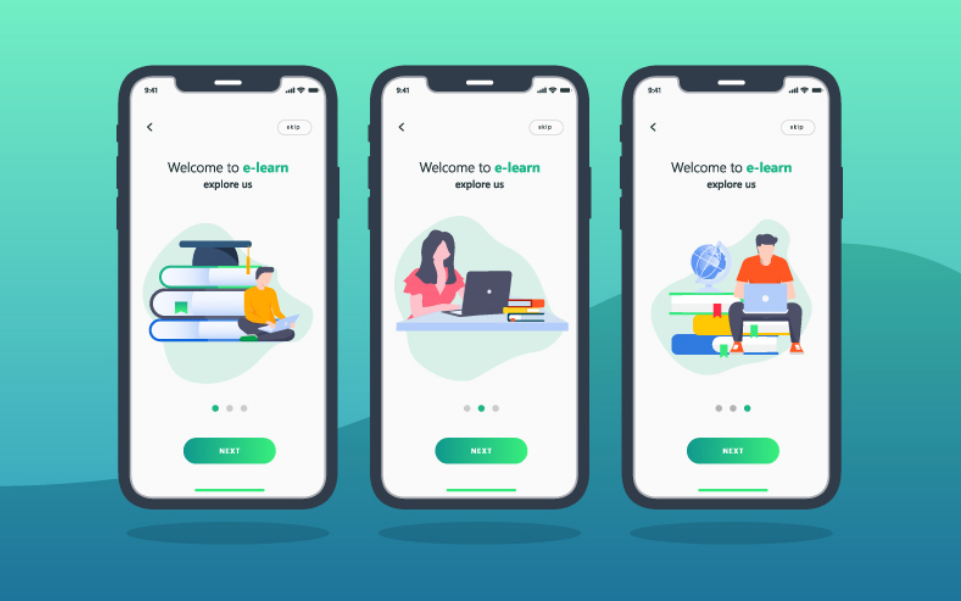

# E Learning App

## Task Description

You are tasked with developing an "Online Learning App" with specific features. This application is aimed at providing students with a platform for online education. The app should offer a user-friendly experience for students and potentially include an admin web application for managing course content and user accounts. The application should be user-friendly and accessible. Below are the feature requirements:

## Features

1. User Authentication:

   - Implement social login options through platforms like Google and Facebook.
   - Allow users to create accounts or sign in using their email and password.

1. Course Search and Catalog:

   - Users should be able to search for courses based on various criteria such as subject, level, and instructor.
   - Display course details, including the instructor's information and a brief description.
   - Enable filters for refining searches, like sorting courses by relevance, popularity, or user ratings.

1. Course Enrollment:

   - Allow students to enroll in courses of their choice.
   - Track enrolled courses and provide easy access to course materials and assignments.

1. Live Classes and Webinars:

   - Provide a feature for hosting live classes or webinars within the app.
   - Allow students to participate in real-time, ask questions, and interact with instructors.

1. Progress Tracking:

   - Implement a progress tracking system to help students keep track of their course completion.
   - Display certificates or achievements upon completing courses.

1. Discussion Forums:

   - Include discussion forums for each course where students can ask questions and engage in discussions.
   - Ensure that instructors can moderate and participate in these discussions.

**Admin Web Application (Optional):** Develop an admin web application for administrators to manage course content, user accounts, and make necessary modifications. Admins should have the ability to:

- Add or remove courses and instructors.
- Monitor user accounts, including user roles and permissions.
- Analyze user data and app usage for improving the learning experience.

## Submission Instructions

- Create a functional prototype or application demonstrating the specified features.
- Organize and document the code for clarity.
- Provide a user manual or instructions on how to use the application.
- Include a brief report outlining the technologies and frameworks used, challenges faced, and potential improvements for future development.

## Evaluation Criteria

- Adherence to the specified features and requirements.
- User interface design and user experience.
- Code quality, organization, and documentation.
- Successful implementation of social login and course enrollment.
- Responsiveness and performance of the mobile app.
- Functionality and usability of the admin web application (if developed).
- Effective use of filters for course search and catalog.

**Important Note:** Before starting the task, make sure you have a clear understanding of the technologies and frameworks needed to develop the app, including mobile app development (e.g., React Native, Flutter) and web development tools (e.g., React, Angular, or similar). Additionally, consider integrating a Learning Management System (LMS) or e-learning platforms for managing course content.
