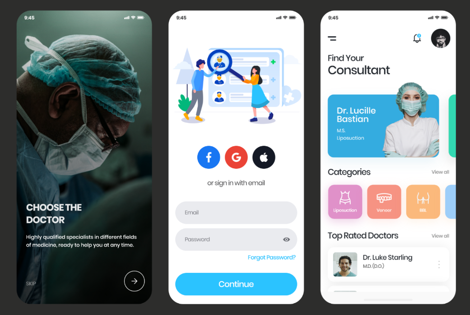

# Find Doctor App

## Task Description

You are tasked with developing a "Find Doctor" application with specific features. This application is aimed at helping patients find the best doctors within a healthcare organization, book appointments, and connect with medical professionals. Additionally, there should be an admin web application (in case, if you have time available) for managing doctor availability and making necessary modifications. The application should be user-friendly and accessible. Below are the feature requirements:

## Features

1. **User Authentication:**

   - Implement social login options through Facebook and Google.
   - Include the ability for users to sign in using their email and password.

1. **Doctor Search:**

   - Users should be able to search for the best doctors within a healthcare organization.
   - Doctors should be listed based on reviews and experience, with detailed profiles for each.
   - Include filters for users to refine their search, such as searching by doctor name, proficiency, and specialization.

1. **Consultation:**

   - Provide a chatbot or a live chat feature for users to inquire about doctor details or other medical information.
   - Users should be able to initiate conversations and get timely responses.

1. **Appointment Booking:**

   - Implement a feature for users to book appointments with their preferred doctors based on available time slots.
   - Users should receive confirmation and reminders for their scheduled appointments.

1. **Review Functionality:**
   - Implement a feature for users to review doctors based on experience. Rating star should be then visible to each doctor profile review’s section.
   - Based on reviews, you should categorize doctors based on average ratings on top doctors chart in every specialized doctors directory.

 

**Admin Web Application:** (In case, if you have time available)

- Develop a web application for administrators to manage doctor availability and make necessary modifications.
- Admins should have the ability to add or remove doctors, set their availability, and update other relevant information.

## Submission Instructions

- You are expected to create a functional prototype or application that demonstrates the specified features.
- The code should be well-organized and documented for clarity.
- Provide a user manual or instructions on how to use the application.
- Include a brief report outlining the technologies and frameworks used, any challenges faced, and potential improvements for future development.

## Evaluation Criteria

- Adherence to the specified features and requirements.
- User interface design and user experience.
- Code quality, organization, and documentation.
- Successful implementation of social login and appointment booking.
- Responsiveness and performance of the mobile app.
- Functionality and usability of the admin web application.
- Effective use of filters for doctor search.

**Important Note:** Before starting the task, make sure you have a clear understanding of the technologies and frameworks needed to develop the app, including mobile app development (e.g., React Native, Flutter) and web development tools (e.g., React, Angular, or similar).
