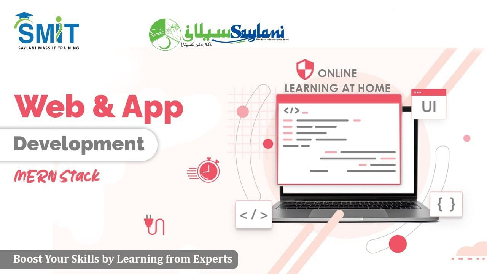

# Saylani Mass IT Training Program Hackathons

## Web & Mobile App Development

This repo contain all past hackathon projects given to students

## Rules

- You can use Internet, books and other resources such as your boilerplate code, however you are not supposed to talk or ask help from other participants of hackathon. SMIT management hold authority to qualify you from hackathon if you violate.
- You will start your hackathon by creating a private repository on Github and you must keep it private until submission time ends.
- Submission will be your github repository url and a public hosting url that can be visited over internet, if you do not push your code on github repository or if you failed to host your website on internet your submission will not be acceptable.
- You **do not have to complete the task 100%**, just try to demonstrate what you have learnt as much as can.

<h3 align="center">Show some ❤ by  this repository!</h3>
